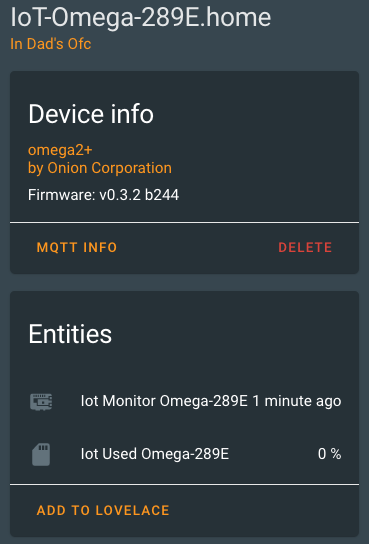

# Omega2 Reporter MQTT2HA Daemon

![Project Maintenance][maintenance-shield]

[![GitHub Activity][commits-shield]][commits]

[](https://www.gnu.org/licenses/gpl-3.0)


A simple Linux python script to query the Omega2 on which it is running for various configuration and status values which it then reports via via [MQTT](https://projects.eclipse.org/projects/iot.mosquitto) to your [Home Assistant](https://www.home-assistant.io/) installation.  This allows you to install and run this on each of your Omega2's so you can track them all via your own Home Assistant Dashboard.



This script should be configured to be run in **daemon mode** continously in the background as a System-V init script. (using instructions/scripts provided)

This script feeds the Lovelace custom card built originally for reporting on Raspberry Pi's but which can also display the status of your Omega2 devices!
*(Jump to below [Lovelace Custom Card](#lovelace-custom-card).)*

## Features

* Tested on Omega2+ v0.3.2 b244 running OpenWrt v4.14.81
* Tested with Home Assistant v0.111.0
* Tested with Mosquitto broker v5.1
* Data is published via MQTT
* MQTT discovery messages are sent so Omega2's are automatically registered with Home Assistant (if MQTT discovery is enabled in your HA installation)
* MQTT authentication support
* No special/root privileges are required by this mechanism

### Omega Device

Each Omega device is reported as:

| Name            | Description |
|-----------------|-------------|
| `Manufacturer`   | Onion Corporation |
| `Model`         | Omega2+  |
| `Name`      | (fqdn) onion-29be.home |
| `sofware ver`  | Name, Version (e.g., v0.3.2 b233) |

### Omega MQTT Topics

Each Omega device is reported as a single topic:

| Name            | Device Class | Unit |   Description
|-----------------|-------------|-------------|-------------|-------------|
| `~/monitor`   | 'timestamp' | date/time | Is a timestamp which shows when the Omega last sent information, carries a template payload conveying all monitored values (attach the lovelace custom card to this sensor!)
| `~/disk_used `   | n/a | percent (%)| Percent of space used on root drive


### Omega Monitor Topic

The monitored topic reports the following information:

| Name            | Description |
|-----------------|-------------|
| `rpi_model`     | tinyfied hardware version string |
| `ifaces`        | comma sep list of interfaces on board [w,e,b] |
| `temperature_c `   | n/a |
| `up_time`      | duration since last booted, as [days] |
| `last_update`  | updates last applied, as [date] |
| `fs_total_gb`       | / total space in [GBytes] |
| `fs_free_prcnt`       | / free space [%] |
| `host_name `       | hostname |
| `fqdn `       | hostname.domain |
| `ux_release `       | os release name (e.g., OpenWrt) |
| `ux_version `       | os version (e.g., v4.14.81) |
| `reporter`  | script name, version running on Omega2 |
| `networking`       | lists for each interface: interface name, mac address (and IP if the interface is connected) |


## Prerequisites

An MQTT broker is needed as the counterpart for this daemon.

MQTT is huge help in connecting different parts of your smart home and setting up of a broker is quick and easy. In many cases you've already set one up when you installed Home Assistant.

## Installation

On a OpenWrt just a few steps are needed to get the daemon working.

To begin installation we need to find the latest released version of this script. Visit our [releases page](https://github.com/ironsheep/Omega2-Reporter-MQTT2HA-Daemon/releases) to find the latest release. Copy the Link Address of the file you want to use for install (.zip or .tar.gz file)

The following example shows the installation below the `/opt` directory:

```shell
# make sure we have python3 installed
opkg install python3 python3-pip

# go to home directory
cd

# download the file
wget {the link address you copied}

# make our /opt directory if not already present
mkdir /opt

# move to new directory
cd /opt

# unpack the release file just downloaded
tar -xzvf /root/{filename}.tar.gz
(or) unzip /root/{filename}.zip

# this installed our files in /opt/Omega2-Reporter-MQTT2HA-Daemon, go there
cd /opt/Omega2-Reporter-MQTT2HA-Daemon

# and install our extra python support
sudo pip3 install -r requirements.txt
```

## Configuration

To match personal needs, all operational details can be configured by modifying entries within the file [`config.ini`](config.ini.dist).
The file needs to be created first:

```shell
cp /opt/Omega2-Reporter-MQTT2HA-Daemon/config.{ini.dist,ini}
vim /opt/Omega2-Reporter-MQTT2HA-Daemon/config.ini
```

You will likely want to locate and configure the following (at a minimum) in your config.ini:

```shell
# ...
hostname = {your-mqtt-broker}

# ...
base_topic = {your home-assistant base topic}

# ...
username = {your mqtt username if your setup requires one}
password = {your mqtt password if your setup requires one}

```

Now that your config.ini is setup let's test!

## Execution

### Initial Test

A first test run is as easy as:

```shell
python3 /opt/Omega2-Reporter-MQTT2HA-Daemon/ISP-Omega2-mqtt-daemon.py
```

**NOTE:** *it is a good idea to execute this script by hand this way each time you modify the config.ini.  By running after each modification the script can tell you through error messages if it had any problems with any values in the config.ini file, or any missing values. etc.*``

Using the command line argument `--config`, a directory where to read the config.ini file from can be specified, e.g.

```shell
python3 /opt/Omega2-Reporter-MQTT2HA-Daemon/ISP-Omega2-mqtt-daemon --config /opt/Omega2-Reporter-MQTT2HA-Daemon
```

### Configure to run script at startup

Now we need to configure our system service. OpenWrt uses the SysV init script convention so let's set this up.

**NOTE:** Daemon mode must be enabled in the configuration file (default).

 
#### Run as Sys V init script

In this form our wrapper script located in the /etc/init.d directory and is run according to symbolic links in the `/etc/rc.x` directories.

Set up the script to be run as a Sys V init script as follows:

   ```shell
   ln -s /opt/Omega2-Reporter-MQTT2HA-Daemon/omega2-reporter /etc/init.d/omega2-reporter

	# configure system to start this script at boot time
   /etc/init.d/omega2-reporter enable

   # let's start the script now, too so we don't have to reboot
   /etc/init.d/omega2-reporter start
  
   # check to make sure all is ok with the start up
   /etc/init.d/omega2-reporter status  # look for "Running" vs. "NOT Running"
   ```

   
### Update to latest

Like most active developers, we periodically upgrade our script. 

To begin installation we need to find the latest released version of this script. Visit our [releases page](https://github.com/ironsheep/Omega2-Reporter-MQTT2HA-Daemon/releases) to find the latest release. Copy the Link Address of the file you want to use for install (.zip or .tar.gz file)

The following example shows the installation below the `/opt` directory:

```shell
# go to home directory
cd

# download the file
wget {the link address you copied}
```


Now You can update to the latest by following these steps:

   ```shell
   # stop the service
  /etc/init.d/omega2-reporter stop
   
   # move to installed options directory
   cd /opt

   # move our existing directory out of the way
   mv Omega2-Reporter-MQTT2HA-Daemon Omega2-Reporter-MQTT2HA-Daemon-old

   # unpack the latest release file just downloaded
   tar -xzvf /root/{filename}.tar.gz
   (or) unzip /root/{filename}.zip

   # this installed our updated files in /opt/Omega2-Reporter-MQTT2HA-Daemon, go there
   cd /opt/Omega2-Reporter-MQTT2HA-Daemon
   # (this makes sure our new files arrived in desired location)

   # restart the service with your new version
   /etc/init.d/omega2-reporter start

   # check status of the running script
   /etc/init.d/omega2-reporter status  # look for "Running" vs. "NOT Running"
   
   # if the status looks good then remove the older isntall directory
   rm -rf /opt/Omega2-Reporter-MQTT2HA-Daemon-old

   ```

   
## Integration

When this script is running data will be published to the (configured) MQTT broker topic "`dvc-{hostname}/...`" (e.g. `rdvc-picam01/...`).

An example:

```json
{
  "info": {
    "timestamp": "2020-07-19T13:17:54-06:00",
    "rpi_model": "RPi 3 Model B r1.2",
    "ifaces": "e,w,b",
    "host_name": "pi3plus",
    "fqdn": "pi3plus.home",
    "ux_release": "stretch",
    "ux_version": "4.19.66-v7+",
    "up_time": "13:17:54 up 14 days",
    "last_update": "2020-07-18T00:51:36-06:00",
    "fs_total_gb": 64,
    "fs_free_prcnt": 10,
    "networking": {
      "eth0": {
        "mac": "b8:27:eb:1a:f3:bc"
      },
      "wlan0": {
        "IP": "192.168.100.189",
        "mac": "b8:27:eb:4f:a6:e9"
      }
    },
    "temperature_c": 55.3,
    "reporter": "ISP-RPi-mqtt-daemon v0.8.5"
  }
}
```

**NOTE:** Where there's an IP address that interface is connected.

This data can be subscribed to and processed by your home assistant installation. How you build your IoT device dashboard from here is up to you!  

## Lovelace Custom Card

We have a Lovelace Custom Card that makes displaying this Omega2 Monitor data very easy.  This script feeds our Raspberry Pi card just fine. You can change the displayed device name on the monitor card by using a one-liner in your view yaml file like this:

```yaml
name_prefix: 'omega2+ '
```

See my project: [Lovelace RPi Monitor Card](https://github.com/ironsheep/lovelace-rpi-monitor-card)

## Credits

Thank you to Thomas Dietrich for providing a wonderful pattern for this project. His project, which I use and heartily recommend, is [miflora-mqtt-deamon](https://github.com/ThomDietrich/miflora-mqtt-daemon)

----


## Disclaimer and Legal

> *Omega2+* is a product offered by *Onion Corporation*
>
> This project is a community project not for commercial use.
> The authors will not be held responsible in the event of device failure or simply errant reporting/control of your garage doors, doggie doors or whatever doors you choose to control with this script.
>
> This project is in no way affiliated with, authorized, maintained, sponsored or endorsed by *Onion Corporation* or any of its affiliates or subsidiaries.

----


### [Copyright](copyright) | [License](LICENSE)

[commits-shield]: https://img.shields.io/github/commit-activity/y/ironsheep/Omega2-Reporter-MQTT2HA-Daemon.svg?style=for-the-badge
[commits]: https://github.com/ironsheep/Omega2-Reporter-MQTT2HA-Daemon/commits/master

[license-shield]: https://img.shields.io/github/license/ironsheep/Omega2-Reporter-MQTT2HA-Daemon.svg?style=for-the-badge

[maintenance-shield]: https://img.shields.io/badge/maintainer-S%20M%20Moraco%20%40ironsheepbiz-blue.svg?style=for-the-badge

[releases-shield]: https://img.shields.io/github/release/ironsheep/Omega2-Reporter-MQTT2HA-Daemon.svg?style=for-the-badge
[releases]: https://github.com/ironsheep/Omega2-Reporter-MQTT2HA-Daemon/releases

